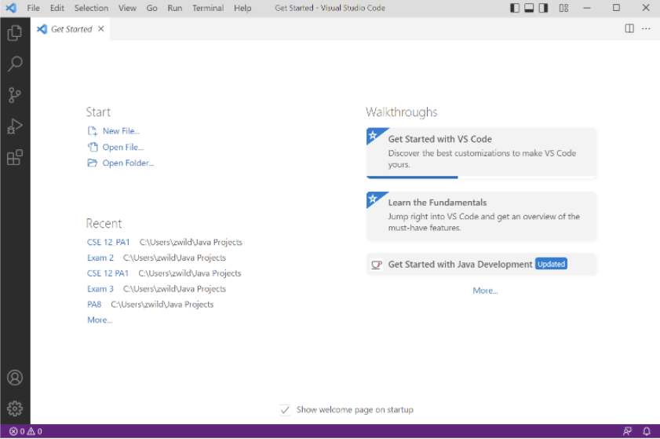
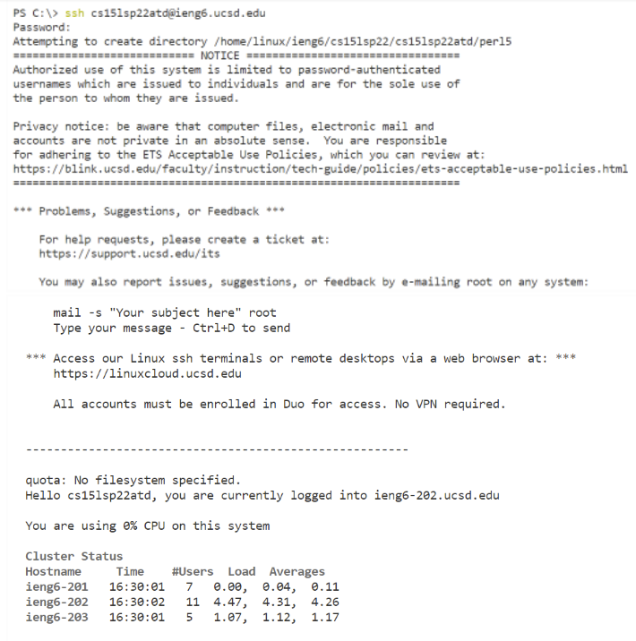
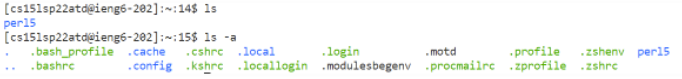
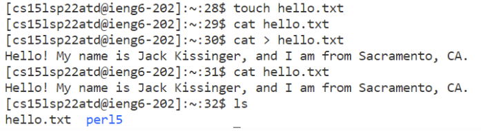
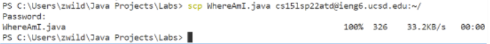
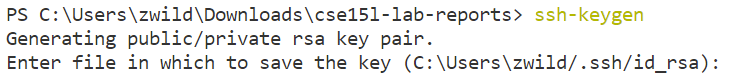
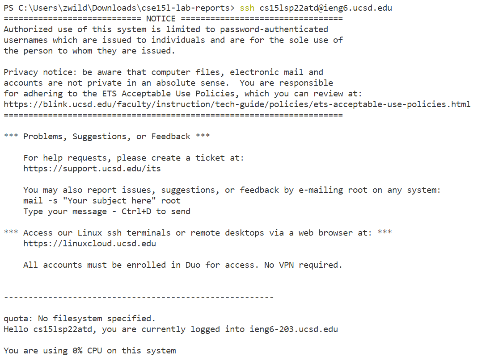

# Week 2 Lab Report
## Step 1: Installing VS Code
This process was very straightforward. I just went to [Visual Studio Code's website](https://code.visualstudio.com/) and pressed the big blue "download" button at the top of the page. Then, I chose the Windows option because my laptop uses that OS. Mac and Linux users have other specified buttons to download. Once VS Code finished installing, I opened it to the main page, as shown below:

## Step 2: Remotely Connecting
To remotely connect to the CSE basement computers, go to terminal and use the command:

`$ ssh cs15lsp22___@ieng6.ucsd.edu `

* Make sure to replace the underscores with your personal characters from your CSE 15L username

Next, the terminal will prompt you to enter your password, and once you do that correctly, you should be remotely connected to the server and see the following messages:

## Step 3: Trying Some Commands
This step is very open-ended, and there are many cool commands to try out! Some examples are:
* `cd`: change directory
* `ls`: lists directories and files in current directory
* `ls -a`: also displays hidden directories
* `ls -lat`: same as `ls -a`, except it provides more information in a list format
* `touch`: create a new file
* `cat`: add text to a file

Here are some of the results from my tests:

## Step 4: Moving Files With "scp"
To do this step, exit from remote access and enter this command in the client (your personal) computer with your username's characters in the "___":

`$ scp <FileName> cs15lsp22___@ieng6.ucsd.edu:~/`

Next, enter your password. Now the file should be copied to the remote computer. You can check that by logging into the remote server again and using the `ls` command.

The numbers on the right side show that the copy was successful. 
## Step 5: Setting an SSH Key
To run commands on the remote computer without entering a password every single time you login, you need to generate and download a pair of public and private keys to substitute for that password. You do this with the command below, then choose the location to save them:

Once this process is complete, copy the **PUBLIC** key only to the remote computer using the `scp` command (as seen in Step 4). Do not transfer the private key, as that would be a security risk. Now you should be able to access the remote computer without entering a password!
## Step 6: Optimizing Remote Connecting
The time needed to connect remotely can be decreased greatly by using the up-arrow key in the terminal to retrieve past commands. It can be decreased even further by completing the `ssh-keygen` process as described in Step 5. In the end, I got the time down to around 3 to 4 seconds at the fastest. This is what it should look like once you don't have to enter a password: 

