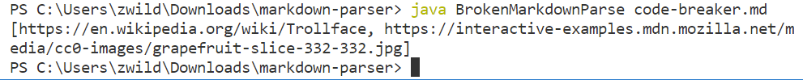
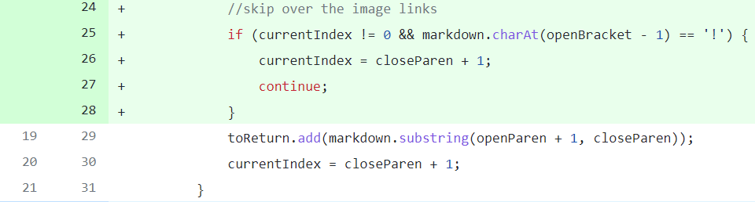
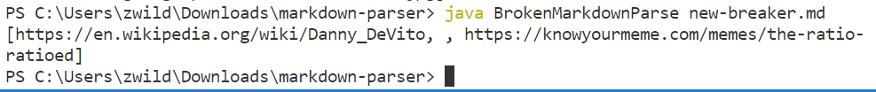
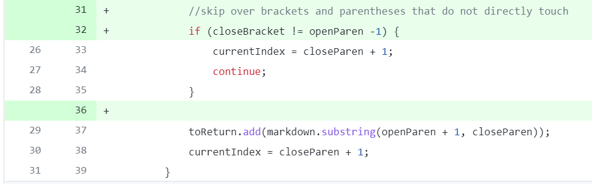

# Week 4 Lab Report
## Code Change #1
The first failure-inducing input I noticed was a file with whitespace at the end, which caused MarkdownParse to enter an infinite loop. The file that caused this symptom was called test-file.md, and you can see that [here](test-file.md). Here is an example of the symptom:

To fix this, I added some if statements that break out of the while loop if no more links are detected in the file (resulting in the indices being set to -1). The changes from this commit are displayed below:

## Code Change #2
The second issue that I realized involved files with links to images. Our `getLinks` function should not include image links, but at this point the method could not tell the difference. The file that caused this symptom was called code-breaker.md, and you can see that [here](code-breaker.md). Here is an example of the symptom (for context, the second link was to an image, so it should not have been there):

To fix this, I added an if statement that will skip over a link if it has an exclamation point before the open bracket. The `currentIndex != 0` condition is there to make sure MarkdownParse doesn't check an index that is out of range by trying to check index -1. The changes from this commit are displayed below:

## Code Change #3
The third big issue I had to fix was regarding brackets and parentheses which were separated by text in between. These instances of brackets/parentheses should not be considered as links, but my program could not tell they were not. The file that caused this symptom was called new-breaker.md, and you can see that [here](new-breaker.md). Here is an example of the symptom (for context, the second "link" - the space - should not have been detected as a link): 

To fix this, I added yet another if statement that skips over pairs of brackets and parentheses that do not directly abut one another. The changes from this commmit are displayed below:

