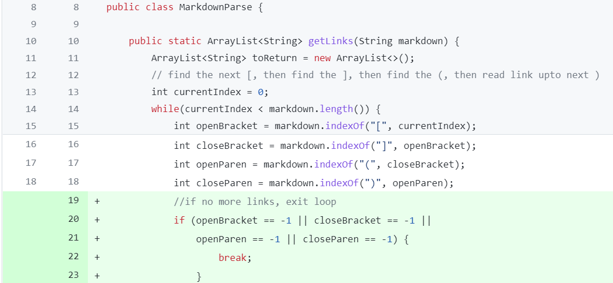

# Week 4 Lab Report
## Code Change #1
The first failure-inducing input I noticed was a file with whitespace at the end, which caused MarkdownParse to enter an infinite loop. To fix this, I added some if statements that break out of the while loop if no more links are detected in the file (resulting in the indices being set to -1). The changes from this commit are displayed below:

 

## Code Change #2

## Code Change #3
