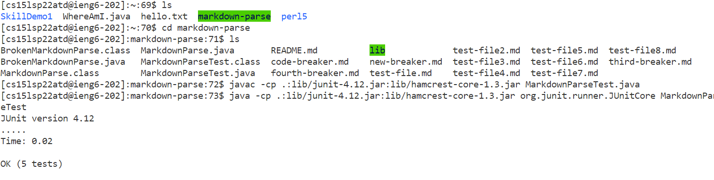

# Week 6 Lab Report
## Streamlining SSH Configuration
The basic command to connect to the ieng6 remote server (`$ ssh cs15lsp22___@ieng6.ucsd.edu`) is very long, and annoying to type out every time one wants to connect. So, to make this process easier in the future, we can add some lines of text to the `.ssh/config` file. To accomplish this, my partner and I opened the .ssh folder using VS Code and pasted the appropriate text into it. This is what that file looks like when we print out its contents afterwards with `cat` on the command line:

The first (non-indented) line - in this case `Host ieng6` - specifies the "alias" of the computer we are trying to connect to. This is the name we now use in the simplified command, as shown below:

In addition to `ssh`, this alias can also be used with the `scp` command to copy files from our local computer to the remote one. An example of that is shown below, copying our group's MarkdownParse.java to the ieng6 computer: 

We can check to make sure this process worked correctly by logging into the remote server again with `ssh` and using the `ls` command to verify the file we want is actually there. As shown below, it worked successfully!

## Setup GitHub Access from ieng6
When my partner and I tried to use the command `git push origin main` on the command line (from the remote computer) to push our changes to the GitHub repository, we got an error message. This is because we hadn't yet set up our SSH key in the GitHub website's settings. To do this, we had to copy the text of the public key in `.ssh/id_rsa.pub`, into the allocated box in the settings section of GitHub. That page can be seen below:

Both the private and public keys are saved locally in the `.ssh` folder, with the private one being inside the `id_rsa` file:

Here is the outcome of us successfully pushing changes we made, which was just adding some random text (albeit after going through a GitHub security process related to "tokens"):

[Link to commit](https://github.com/CobyLsy/cse15l-lab-reports/commit/5db7f8ad8e2e90d5747594ac4d8901b3864c86c7)

## Copy Whole Directories with `scp -r`
To securely copy an entire directory (in this case `markdown-parser`) to the remote server, we use the following command:
`$ scp -r . cs15lsp22___@ieng6.ucsd.edu:~/markdown-parse` (where the underscores are replaced with the personal username's letters)

Here is an example of me doing it:

Now that the entire directory has been copied over to the remote computer, I am able to run my JUnit tests there also, as shown below:

Multiple commands can also be combined together with semicolons and executed in sequence with one another. We can copy the directory to the remote server, log in, and run the tests in one line with this set of commands:

