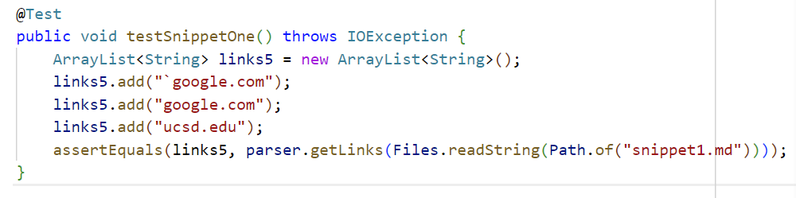
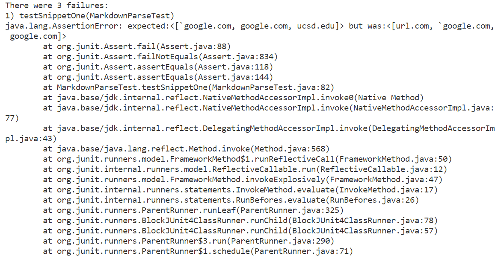
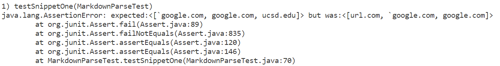
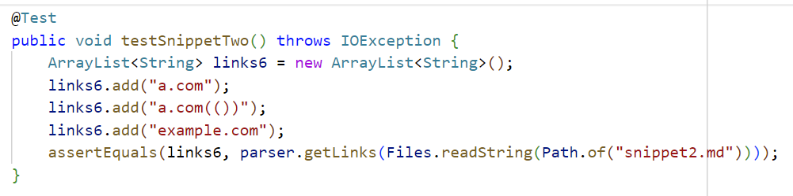
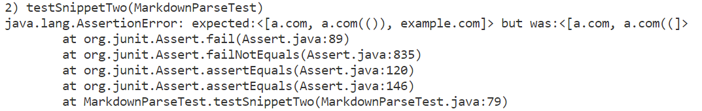
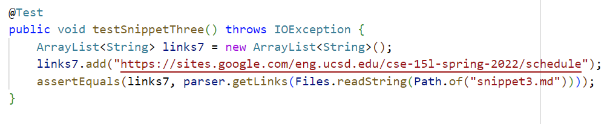
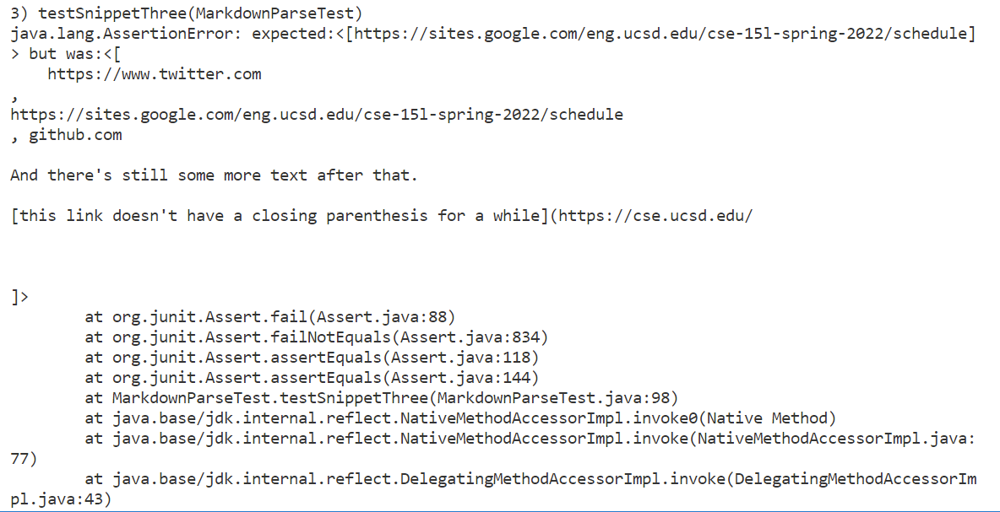
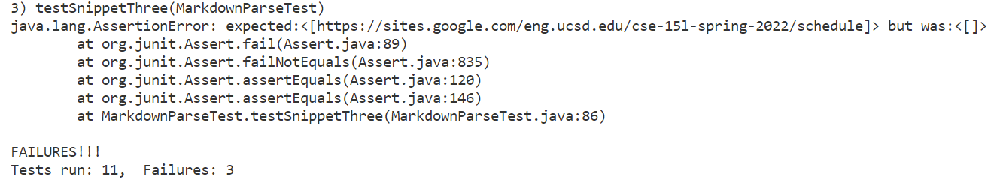

# Week 8 Lab Report
## Important Links
[My Repository](https://github.com/ujik500/markdown-parser.git)

[Other Group's Repository](https://github.com/rmccrystal/markdown-parser)

## Snippet 1
The output for this snippet should be ``["`google.com", "google.com", "ucsd.edu"]``.

My Testcase:

Testcase result on my implementation:

Testcase result on other group's implementation:

## Snippet 2
The output for this snippet should be ``["a.com", "a.com(())", "example.com"]``.

My Testcase:

Testcase result on my implementation:

Testcase result on other group's implementation:

## Snippet 3
The output for this snippet should be ``["https://sites.google.com/eng.ucsd.edu/cse-15l-spring-2022/schedule"]``.

My Testcase:

Testcase result on my implementation:

Testcase result on other group's implementation:

## Answers to Questions
**Do you think there is a small (<10 lines) code change that will make your program work for snippet 1 and all related cases that use inline code with backticks? If yes, describe the code change. If not, describe why it would be a more involved change.**

I think it would be possible to make it work with the backticks by having the parser skip over backtick text within brackets and ignore brackets within backticks. To do this, you could use the indexOf method to identify where the next backtick is going to be, and check if it is between brackets or vice versa.

**Do you think there is a small (<10 lines) code change that will make your program work for snippet 2 and all related cases that nest parentheses, brackets, and escaped brackets? If yes, describe the code change. If not, describe why it would be a more involved change.**

I think this change would be a little more involved. I would use a stack data structure to keep track of the opening and closing brackets, but that would be a more difficult change to manage and implement.

**Do you think there is a small (<10 lines) code change that will make your program work for snippet 3 and all related cases that have newlines in brackets and parentheses? If yes, describe the code change. If not, describe why it would be a more involved change.**

This change would be relatively easy to implement. If there are more than two newline characters between a given set of parentheses or brackets, then just skip the currIndex down to after the close parentheses.
