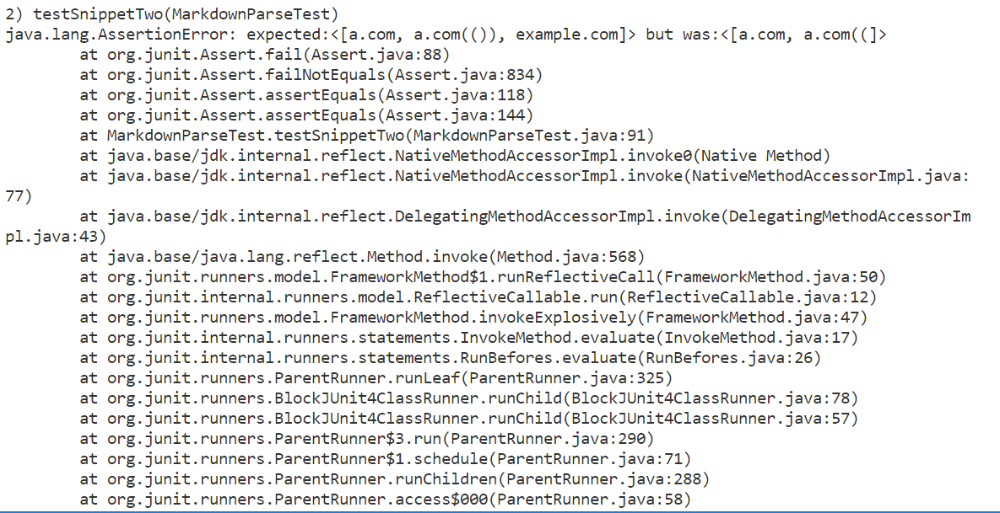

# Week 8 Lab Report
## Important Links
[My Repository](https://github.com/ujik500/markdown-parser.git)

[Other Group's Repository](https://github.com/rmccrystal/markdown-parser)

## Snippet 1
The output for this snippet should be ``["`google.com", "google.com", "ucsd.edu"]``.

My Testcase:

Testcase result on my implementation:

Testcase result on other group's implementation:

## Snippet 2
The output for this snippet should be ``["a.com", "a.com(())", "example.com"]``.

My Testcase:

Testcase result on my implementation:

Testcase result on other group's implementation:

## Snippet 3
The output for this snippet should be ``["https://sites.google.com/eng.ucsd.edu/cse-15l-spring-2022/schedule"]``.

My Testcase:

Testcase result on my implementation:

Testcase result on other group's implementation:

## Answers to Questions
**Do you think there is a small (<10 lines) code change that will make your program work for snippet 1 and all related cases that use inline code with backticks? If yes, describe the code change. If not, describe why it would be a more involved change.**

I think it would be possible to make it work with the backticks

**Do you think there is a small (<10 lines) code change that will make your program work for snippet 2 and all related cases that nest parentheses, brackets, and escaped brackets? If yes, describe the code change. If not, describe why it would be a more involved change.**

**Do you think there is a small (<10 lines) code change that will make your program work for snippet 3 and all related cases that have newlines in brackets and parentheses? If yes, describe the code change. If not, describe why it would be a more involved change.**
