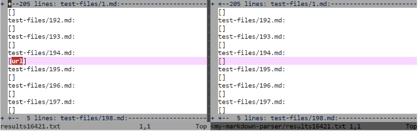

# Week 10 Lab Report

## Overview
I found both of the testcases with different outputs (#194 and #509) by using the `vimdiff` command on the outputs of a bash script for loop. I have linked the test-files in the provided repositiory below:

[#194](https://github.com/nidhidhamnani/markdown-parser/blob/8dd87e6914ae40a4321aac8e2483e349de40b03c/test-files/194.md)

[#509](https://github.com/nidhidhamnani/markdown-parser/blob/8dd87e6914ae40a4321aac8e2483e349de40b03c/test-files/509.md)
 
## Test File #194

Here are the results of running this test file on my implementation (left), and the provided implementation (right):

The correct output should be: `["my_(url)"]`

Therefore, neither of the implementations were correct. In this case, I think a change would have to be made, so that if there is a colon after a valid close bracket, then the text immediately after that (and before the next space), should be considered the link, no matter what the parentheses are like in that block of text. I think this is to allow for links with parentheses as characters inside the URL. I would just add an if statement to account for this edge case, as well as a tracker for the location of the next colon. The change would have to occur in the code shown below, in this general area:

## Test File #509

Here are the results of running this test file on my implementation (left), and the provided implementation (right):

The correct output should be: `["/uri"]`

Once again, neither implementation got this correct. This time, the problem was that the text inside the quotation marks should have been treated as an optional title, not as part of the URL itself. In addition, the leading and trailing spaces should have been removed. To fix these problems, I would add a statement to strip off the spaces, and an if statement to ignore the text between quotation marks when finding the URL. I would make the change in this area of my markdown-parse file:

